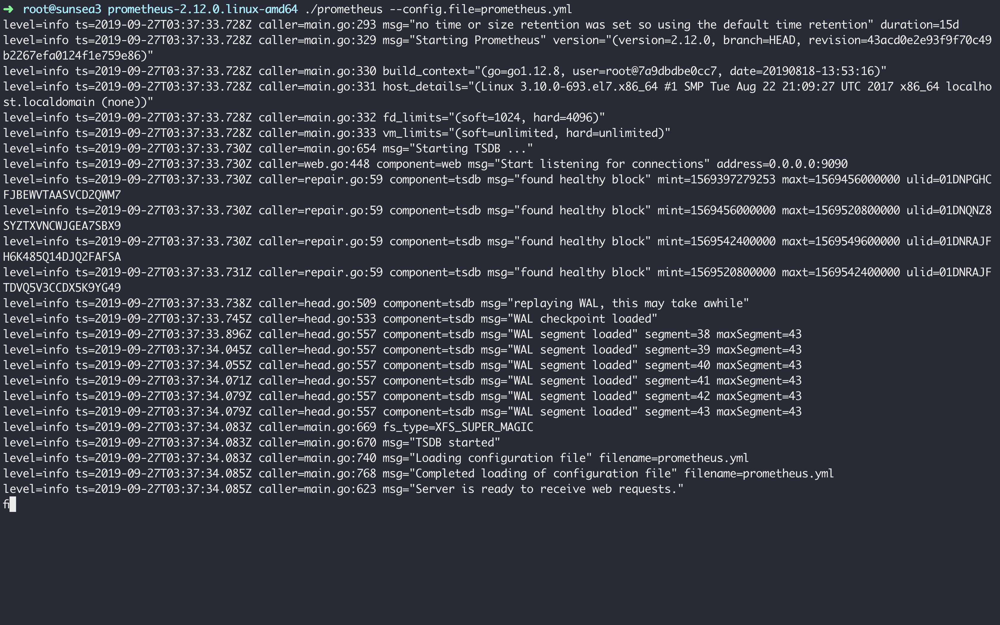

# 监控告警服务

## INTRODUCTION

### Prometheus

- Prometheus 是使用 Go 语言开发的开源监控告警系统。
- Prometheus 是一种 TSDB( Time series Database 时序列数据库)
  - 大部分时间处于写入状态
  - 按顺序写入，按时间顺序排列
  - 进行删除操作是一般删除一整块数据，而不会只删除其中一条数据
  - 没必要做缓存
  - 高并发读操作很常见
- Prometheus 组件
  - **Prometheus server** —— 数据采集和存储，提供PromQL查询语言的支持。
  - **exporters** ——收集指标，暴露 API（ /metrics ） 供 Prometheus Server Pull
  - ** alert manager** —— 处理告警
  - Client SDK —— 官方类库 Java Python Go Ruby
  - Push Gateway —— 中间网关for supporting short-lived jobs
  - 组件架构图：：
  - 
  - 

> https://www.hi-linux.com/posts/25047.html
>
> ####  Prometheus的特点
>
> - 多维度数据模型。
> - 灵活的查询语言。
> - 不依赖分布式存储，单个服务器节点是自主的。
> - 通过基于 HTTP 的 pull 方式采集时序数据。
> - 可以通过中间网关进行时序列数据推送。
> - 通过服务发现或者静态配置来发现目标服务对象。
> - 支持多种多样的图表和界面展示，比如 Grafana 等。

## GETTING START


### 安装与启动 Prometheus

- 简单配置示例 `prometheus.yml`

  ```yaml
  global: # 全局设置
    scrape_interval:     15s # Set the scrape interval to every 15 seconds. Default is every 1 minute.
    evaluation_interval: 15s # Evaluate rules every 15 seconds. The default is every 1 minute.
    # scrape_timeout is set to the global default (10s).
  alerting:
    alertmanagers:
    - static_configs:
      - targets:
        # - alertmanager:9093
  rule_files:
    # - "first_rules.yml"
    # - "second_rules.yml"
    - 'prometheus.rules.yml' 
  scrape_configs:
    # The job name is added as a label `job=<job_name>` to any timeseries scraped from this config.
  
    - job_name: 'node_exporter'
      scrape_interval: 5s
      static_configs:
        - targets: ['192.168.5.199:9100']
          labels:
            group: 'client-node-exporter'
  ```

- 简单配置示例 `prometheus.rules.yml`

  ```yaml
  groups:
  - name: example
  rules:
	    - alert: test
	      expr: node_memory_Active_bytes > 1
	      for: 5s
	      annotations:
	        summary: "worry_test"
	        description: "worry_test"
	```
	
	
	
- 解压缩后即可启动

  ```shell
  ./prometheus --config.file=prometheus.yml
  ```

	

### 安装与启动 Node exporter

```shell
./node_exporter
```

### 安装与启动 alert manager

- 配置示例
  ```yaml
    global:
      resolve_timeout: 5m

    route:
      group_by: ['alert']
      # 因为可能存在相似的告警通知（notification）所以需要对这些通知分组，为了能够集中更多相似的通知，需要设置 group_wait group_interval
      group_wait: 5s #  首次启动等待时间.如果在等待时间内当前 group 接收到了新的告警，这些告警将会合并为一个通知向 receiver 发送。
      group_interval: 5s  # 相同的 Group 之间发送告警通知的时间间隔
      repeat_interval: 1m  # 问题持续时，重复报警间隔
      receiver: 'web.hook'
    receivers:
    - name: 'web.hook'
      webhook_configs:
      - url: 'http://127.0.0.1:5001/'
    inhibit_rules:
      - source_match:
          severity: 'critical'
        target_match:
          severity: 'warning'
        equal: ['alertname', 'dev', 'instance']
  ```

- 启动

  ```shell
  ./alertmanager --config.file=alertmanager.yml
  ```

### 安装启动 Grafana

- 安装

  ```shell
  wget https://dl.grafana.com/oss/release/grafana-6.4.3-1.x86_64.rpm
  sudo yum localinstall grafana-6.4.3-1.x86_64.rpm-
  ```

- 启动

  ```shell
  systemctl start grafana-server
  ```

  

