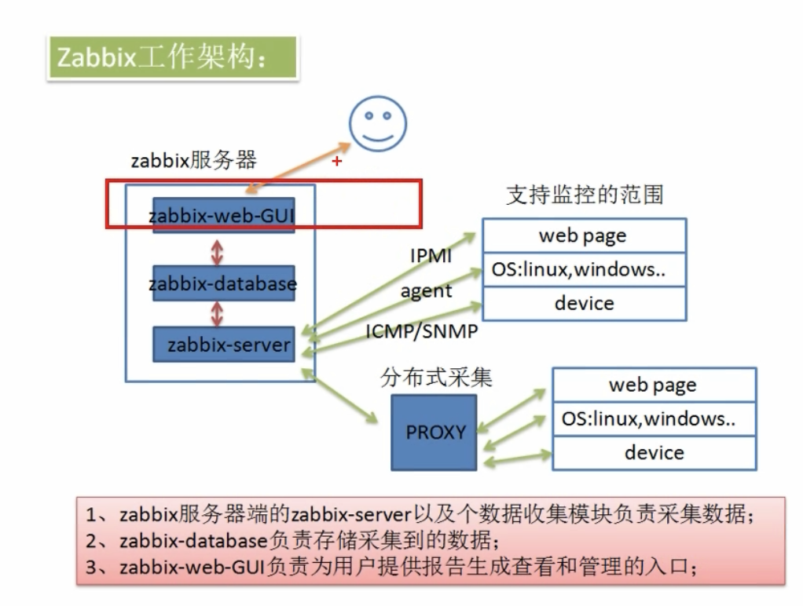
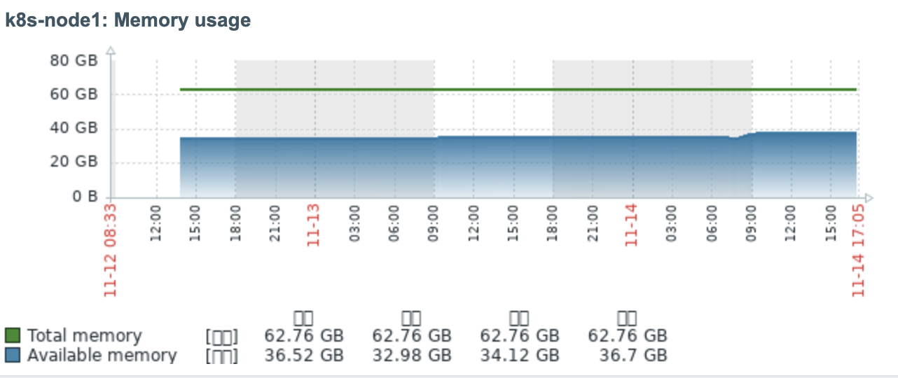

# Zabbix 监控系统部署文档

## ZABBIX SIMPLE INTRODUCTION



- zabbix 是一个基于 WEB 界面的提供分布式系统监视以及网络监视功能的企业级开源解决方案（基于 GPL V2）
  - Web 界面：基于 B/S 结构 ，基于 C/S 结构收集数据。拥有状态展示（状态是否正常，显示红色绿色）与图表展示📈 
  - 分布式系统监控：多个分区服务器监控，降低总服务器压力
  - 企业级开源解决方案：企业级——稳定，高效；开源——免费；GPL V2——可修改源码，可进行售卖但必须提供源码包。
- zabbix 主要由两部分组成
  -  **Zabbix server endpoint** --- 收集来自 Zabbix Agent 的监控数据，然后进行数据处理，数据展示
    - Zabbix-web-GUI：用户查看与管理的 WEB 界面
    - Zabbix-database：存储收集到的数据，通常为Mysql
    - Zabbix-server：接受来自 agent 或 proxy 的数据
  -  **zabbix agent** ---**收集**该监控主机的指标数据并发送给 Zabbix Server 

##  DEPLOY Zabbix Server with Docker 

### 创建一个网络

Zabbix server 端的各个组件之间的网络要连通，为了方便配置管理，我们单独给 Zabbix 分配一个 bridge 网络。在这个网络内，各个容器之间可以直接使用各自的容器名通信。例如：`curl zabbix-web `即可访问到`zabbix-web`，无需知道其容器 IP。

```shell
docker network create zabbix
```

### Mysql 的配置安装

- 拉取镜像

  ```shell
  docker pull mysql:5.7.24 # 测试过最新版8.0会报错，只能用旧版。
  ```

- [tips] 我们需要把 mysql 的数据存储的位置映射出来。如何找到数据存储位置：

  ```mysql
  # 创建一个测试的容器，临时用来查看数据存储的目录。
  # docker run --name test-mysql -t -e MYSQL_ROOT_PASSWORD="xxx" -d mysql:5.7.24
  # docker exec -it test-mysql
  # mysql -u root -p xxx
  mysql> select @@datadir;
  +-----------------+
  | @@datadir       |
  +-----------------+
  | /var/lib/mysql/ |
  +-----------------+
  1 row in set (0.01 sec)
  ```

- 创建一个数据卷

  ```shell
  docker volume create zabbix-mysql
  ```

- 创建并运行一个 Mysql 容器，注意配置好数据库**密码**⚠️

  ```shell
  # -e 配置容器内环境变量，用来指定相关用户密码数据库名称。
  # --mount 链接刚刚创建的数据卷，用于永久化数据，
  docker run --name zabbix-mysql -t \
        --network zabbix \
        --restart=always \
        -e MYSQL_DATABASE="zabbix" \
        -e MYSQL_USER="zabbix" \
        -e MYSQL_PASSWORD="xxx1" \
        -e MYSQL_ROOT_PASSWORD="xxx2" \
        --mount source=zabbix-mysql,target=/var/lib/mysql \
        -d mysql:5.7.24 \
        --character-set-server=utf8 --collation-server=utf8_bin
  ```


### Zabbix Server 组件安装

- 启动 Zabbix Java Gateway 实例

  ```shell
  docker run --name zabbix-java-gateway -t \
  			--network zabbix \
        -d zabbix/zabbix-java-gateway:latest
  ```


- 启动 Zabbix Server

  ```shell
  # 注意这里配置的 Mysql 密码要与上面配置的密码相同。
  docker run --name zabbix-server -t \
        --network zabbix \
        --restart=always \
        -v /etc/localtime:/etc/localtime:ro \
        -v /docker_data/zabbix/alertscripts:/usr/lib/zabbix/alertscripts \
        -v /docker_data/zabbix/externalscripts:/usr/lib/zabbix/externalscripts \
        -e DB_SERVER_HOST="zabbix-mysql" \
        -e MYSQL_DATABASE="zabbix" \
        -e MYSQL_USER="zabbix" \
        -e MYSQL_PASSWORD="xxx1" \
        -e MYSQL_ROOT_PASSWORD="xxx2" \
        -e ZBX_JAVAGATEWAY_ENABLE="true" \
        -e ZBX_JAVAGATEWAY="zabbix-java-gateway" \
        -e ZBX_CACHESIZE="128M" \
        -e ZBX_VMWARECACHESIZE="128M" \
        -p 10051:10051 \
        -d zabbix/zabbix-server-mysql:latest
  ```

- 启动 Zabbix Web

  ```shell
  docker run --name zabbix-web -t \
        --network zabbix \
        --restart=always \
        -e DB_SERVER_HOST="zabbix-mysql" \
        -e MYSQL_DATABASE="zabbix" \
        -e MYSQL_USER="zabbix" \
        -e MYSQL_PASSWORD="xxx1" \
        -e MYSQL_ROOT_PASSWORD="xxx2" \
        -e PHP_TZ="Asia/Shanghai" \
        -p 6666:80 \
        -d zabbix/zabbix-web-nginx-mysql
  ```

- 使用浏览器访问`ip:80`验证服务是否正常。用户密码为 Admin zabbix

## Docker-compose 一键部署
- 新建一个文件夹，创建文件 `docker-compose.yml`

  ```yml
  version: '3.7'
  services:
    zabbix-mysql:
      image: mysql:5.7.24
      container_name: zabbix-mysql
      restart: always
      networks:
        - zabbix
      command: ["--character-set-server=utf8", "--collation-server=utf8_bin"]
      volumes: 
        - "zabbix-mysql:/var/lib/mysql" # 注意，自建卷挂载要有双引号否则报错, 冒号后不要有空格
      environment:
        - MYSQL_DATABASE=zabbix
        - MYSQL_USER=zabbix
        - MYSQL_PASSWORD=xxx1 # 指定数据库 zabbix 用户密码
        - MYSQL_ROOT_PASSWORD=xxx2 # 指定数据库 root 用户密码
      ulimits:
        nofile:
          soft: 65536
          hard: 65536
  
    zabbix-JavaGateway:
      image: zabbix/zabbix-java-gateway:latest
      container_name: zabbix-JavaGateway
      restart: always
      networks:
        - zabbix
  
    zabbix-server:
      image: zabbix/zabbix-server-mysql:latest
      container_name: zabbix-server
      restart: always
      networks:
        - zabbix
      volumes:
        - /etc/localtime:/etc/localtime:ro
        - /docker_data/zabbix/alertscripts:/usr/lib/zabbix/alertscripts # 告警脚本位置
        - /docker_data/zabbix/externalscripts:/usr/lib/zabbix/externalscripts
      environment:
        - DB_SERVER_HOST=zabbix-mysql
        - MYSQL_DATABASE=zabbix
        - MYSQL_USER=zabbix
        - MYSQL_PASSWORD=xxx1 # 指定数据库 zabbix 用户密码
        - MYSQL_ROOT_PASSWORD=xxx2 # 指定数据库 root 用户密码
        - ZBX_CACHESIZE=128M
        - ZBX_VMWARECACHESIZE=128M
        - ZBX_JAVAGATEWAY_ENABLE=true
        - ZBX_JAVAGATEWAY=zabbix-JavaGateway
      ports:
        - 10051:10051
  
    zabbix-web:
      image: zabbix/zabbix-web-nginx-mysql:latest
      container_name: zabbix-web
      restart: always
      networks:
        - zabbix
      environment:
        - DB_SERVER_HOST=zabbix-mysql
        - MYSQL_DATABASE=zabbix
        - MYSQL_USER=zabbix
        - MYSQL_PASSWORD=xxx1 # 指定数据库 zabbix 用户密码
        - MYSQL_ROOT_PASSWORD=xxx2 # 指定数据库 root 用户密码
        - PHP_TZ=Asia/Shanghai
      ports:
        - 80:80
        - 443:443
      
  networks:
    zabbix:
      external: true # 要求自己创建 network
  
  volumes:
    zabbix-mysql:
      external: true # 要求自己创建 volume
  ```

- 执行以下命令

  ```shell
docker volume create zabbix-mysql
  docker network create zabbix
  docker-compose up -d
  ```

## DEPLOY Zabbix agent

使用 ansible 可以快速的把 agent 安装到多台主机，为了清晰整个部署流程，首先熟悉一下单机部署的流程。

### 单机部署

- 添加仓库
  - RHEL 8:

    ```shell
    rpm -Uvh https://repo.zabbix.com/zabbix/4.4/rhel/8/x86_64/zabbix-release-4.4-1.el8.noarch.rpm
    ```

  - RHEL 7:

    ```shell
    rpm -Uvh https://repo.zabbix.com/zabbix/4.4/rhel/7/x86_64/zabbix-release-4.4-1.el7.noarch.rpm
    ```


  - RHEL 6:

    ```shell
    rpm -Uvh https://repo.zabbix.com/zabbix/4.4/rhel/6/x86_64/zabbix-release-4.4-1.el6.noarch.rpm
    ```

- 安装与配置被监控主机的`agent`
  - 安装 agent

    ```shell
    yum install -y zabbix-agent
    ```

  - agent 配置 `vim /etc/zabbix/zabbix_agentd.conf`

    ```shell
    # 主要修改以下四个配置，其余默认～
    Server=192.168.5.104 # zabbix server IP 地址
    ListenPort=18888
    ServerActive=192.168.5.104 # zabbix server IP 地址
    Hostname=sunsea3 # 主机名
    ```
    
  - 启动 agent
  
    ```shell
    systemctl start zabbix-agent.service
    systemctl enable zabbix-agent.service
    ```
  -  开通防火墙 18888/tcp 端口


### ansible 多主机批量快速部署

- `/etc/ansible/hosts`上配置主机

  ```shell
  # 按照格式配置好资源主机
  # [group_name] 拿来分组
  [k8s-nodes]
  192.168.1.2 hostname=k8s-node1 ansible_ssh_port=22 ansible_ssh_user=root ansible_ssh_pass=xxx
  
  192.168.1.3  hostname=k8s-node2 ansible_ssh_port=22 ansible_ssh_user=root ansible_ssh_pass=xxx
  
  192.168.1.4  hostname=k8s-node3 ansible_ssh_port=22 ansible_ssh_user=root ansible_ssh_pass=xxx
  ```

- 批量添加源

  ```shell
  ansible k8s-nodes -m shell -a "rpm -Uvh https://repo.zabbix.com/zabbix/4.4/rhel/7/x86_64/zabbix-release-4.4-1.el7.noarch.rpm" # url参考上方单机部署
  ```

- 批量安装 `agent` 

  ```shell
  # 由于是外国的网络，部分主机安装过程可能会出现中断失败 ，这时需要重复运行多次才能全部安装成功。
  ansible k8s-nodes -m yum -a "name=zabbix-agent"
  ```

- 配置 ansible playbook，用于批量修改配置文件

  ```yaml
  # vim ansible-zabbix-agentd.yml
  - hosts: k8s-nodes # 要求与你配置 hosts 时指定的组名一致
    tasks:
      - name: modify server
        lineinfile:
          path: /etc/zabbix/zabbix_agentd.conf
          regexp: '^Server='
          line: Server=192.168.1.xx

      - name: modify port
        lineinfile:
          path: /etc/zabbix/zabbix_agentd.conf
          regexp: '^# ListenPort='
          line: ListenPort=18888

      - name: modify serveractive
        lineinfile:
          path: /etc/zabbix/zabbix_agentd.conf
          regexp: '^ServerActive='
          line: ServerActive=192.168.1.xx

      - name: modify hostname
        lineinfile:
          path: /etc/zabbix/zabbix_agentd.conf
          regexp: '^Hostname='
          line: Hostname={{ hostname }}
  ```

- 运行 `ansible-playbook ansible-zabbix-agentd.yml ` 运行 playbook

- 查看各主机的配置文件修改是否正确

  ```shell
  ansible k8s-nodes -m shell -a 'cat /etc/zabbix/zabbix_agentd.conf |grep -Ev "^$|^#"'
  ```

- 启动 agent 服务

  ```shell
  ansible k8s-nodes -m shell -a "systemctl start zabbix-agent.service"
  ansible k8s-nodes -m shell -a "systemctl enable zabbix-agent.service"
  ```

- 查看端口是否正常监听

  ```shell
  ansible k8s-nodes -m shell -a "netstat -lntp|grep 18888"
  ```

命令行至此部署完毕，可以开始去网页端进行配置了！

## Zabbix 告警配置

### 短信告警

Zabbix 内置的短信告警需要硬件设备的支持才能使用。这种方法实现起来比较麻烦，撰写一个简单的脚本调用短信服务提供商的 API 会更加方便。

curl 命令无法直接调用 API。需要使用 Python 调用短信服务接口，并通过 Flask 暴露 API 给 Curl

#### 构建 Python send sms 镜像

- 新建一个文件夹 `zabbix-sendsms`，分别编辑三个文件：app.py、Dockerfile、requirements.txt

- Python Flask 脚本

  Python 脚本使用 requests 模块调用短信 API 接口，使用 FLASK 监听一个 POST 请求，当收到这个请求， FLASK 自动调用 requests 请求短信服务。

  ```python
  # vim app.py
  from flask import Flask
  from flask import request
  import requests
  app = Flask(__name__)
  
  def sendsms(phone_number, msg):
      url = # 服务商提供的 API
  
      querystring = {"content": '{"code":"%s"}' % msg}
      response = requests.request("GET", url, params=querystring)
      return response.text
  
  @app.route('/sendsms', methods=['POST'])
  def action():
      pn = request.form.get("mobile")
      msg = request.form.get("msg")
      return sendsms(pn, msg)
  
  if __name__ == '__main__':
      app.run(host='0.0.0.0')
  ```
  
- Dockerfile

  ```dockerfile
  FROM python:3.6
  COPY . /app
  WORKDIR /app
  RUN pip install -r requirements.txt -i https://pypi.tuna.tsinghua.edu.cn/simple
  ENV FLASK_APP=app.py
  EXPOSE 5000
  ENTRYPOINT ["python"]
  CMD ["app.py"]
  ```

- requirements.txt

  ```shell
  flask
  ```

- 确保 app.py、Dockerfile、requirement.txt，放置在同一个文件夹内，然后执行命令

  ```shell
  docker bulid -t sendsms .
  ```

#### 运行 Python send sms 容器，编写 SHELL 脚本调用 Python 暴露的接口

- 运行这个 Python 容器

  ```shell
  docker run --network zabbix --name "zabbix-sendsms" -t -d sendsms
  ```

- 进入 Zabbix-server 容器内部配置告警脚本`sendsms.sh`

  ```shell
  # docker exec -it zabbix-server bash
  # cd /usr/lib/zabbix/alertscripts
  # vi sendsms.sh
  mobile=$1
  msg=$2
  curl -X POST zabbix-sendsms:5000/sendsms -F mobile=$mobile -F msg="$msg"
  echo "$1 $2" >> /usr/lib/zabbix/alertscripts/sms.log
  # 保存后，进行如下设置
  # chown zabbix:zabbix ./sendsms.sh
  # chmod u+x ./sendsms.sh
  # touch sms.log
  # chown zabbix:zabbix sms.log
  # chmod u+w ./sms.log
  ```

- Zabbix-server 镜像没有自带 curl，需要自行安装。镜像的基础系统是Alpine Linux ，使用 apk 作为包管理工具。apk 的默认源地址国内访问速度很慢，我们需要先修改一下 apk 源

  ```shell
  # 确保在 Zabbix-server 容器内部执行命令
  sed -i 's/dl-cdn.alpinelinux.org/mirrors.ustc.edu.cn/g' /etc/apk/repositories
  
  apk update
  ```

- 然后执行安装 curl `apk add curl`

- 测试脚本能否正常运行

  ```shell
  ./sendsms.sh 13414960397 "hello world\nerror"
  ```

- 脚本配置至此完成，可以去 web 页面配置自动告警了。

#### 动作告警短信模板

```shell
★★发生故障★★\n告警时间：{EVENT.DATE} {EVENT.TIME} \n故障主机名：{HOST.NAME}\n故障主机 IP：{HOST.IP}\n故障名：{TRIGGER.NAME}\n故障详情：{TRIGGER.DESCRIPTION}\n故障等级：{EVENT.SEVERITY}\n指标状态：{ITEM.VALUE}\nURL：{TRIGGER.URL}\n
```

## BUGS

### 同一内网，防火墙关闭情况下，端口连接不通

- 发生在部分 agent 主机

  ```verilog
  Get value from agent failed: cannot connect to [[192.168.1.xxx]:18888]: [4] Interrupted system call 
  ```
  
  - 成因分析
  
    【猜想】这些同一内网的主机，实际上可能分布在两个不同的宿主机上。不同宿主机之间有安全组的隔离，由于云厂商的设计缺陷【同一内网的主机应放行】，导致流量在前往目标主机的时候被拦截，导致了以上以上server 无法连接到 agent 的情况。
  
  - Solution
  
    前往云平台的安全组设置，写入 port 即可，放行不要填写全网，填写内网的网段即可。

### server 无法从获取宿主机的 agent 处获取数据：

- 这个问题只出现在 Server 所在的宿主机：

  ```verilog
  Received empty response from Zabbix Agent at [192.168.5.104]. Assuming that agent dropped connection because of access permissions
  ```

  - 成因分析

    agent 端配置文件有一个配置选项 Server，这个值应当设定为 zabbix-server 所在服务器的 IP 地址，设置以后，agent 只会接受来自这些指定的服务器的请求，其他服务器的请求他就会拒绝。我们的 Server 端是使用Docker 进行部署的，它出来的 IP 并非 localhost ，而是一个常见的以 172 开头的 IP。

    使用 Docker 搭建的 Zabbix 监控架构如图。
    
    
    
    如图，Server 请求其他宿主机的 agent，流量会经过宿主机网卡，当其他宿主机的 agent 收到这个请求后，他发现的 IP 就是 Server 所在宿主机的IP【192.168.1.20】，这个 IP 与配置文件【Server=192.168.1.20】 中指定的IP相一致，agent 就接受了这个请求，返回响应。
    
    Server 请求本机的 agent 情况就有所不同。他的请求只会经过 Docker 的虚拟网卡，因此当 agent 收到这个请求的时候，它识别到的 IP 是 这个 Docker 容器的 IP 【172.17.0.8】，这个 IP ，与配置文件指定的 IP 【192.168.1.20】不一致，所以 agent 拒绝了我们这个请求，返回错误：`access permissions`
    
    网上的办法说是在这个 agent 的 Server 配置选项后加上 localhost，这显然是不正确的，这只适合二进制包的部署方法。我们的 Zabbix-Server 是使用 Docker 运行的，因此他的 IP 并非 localhost。
    
    问题根源就找到了，解决办法就很简单了：
    
  - soulution

    - Server 端所在的宿主机的 agent 的配置选项 Server 用逗号分隔，加上 docker 容器 IP【使用 docker inspect 命令可以查询容器 IP】

### 容器自动终止

- 排查日志发现一下记录

  ```verilog
  ...
  Database 'zabbix' already exists. please be careful with database COLLATE!
  ...
  zbx_mem_malloc(): out of memory (requested 16 bytes)
  zbx_mem_malloc(): please increase CacheSize configuration parameter
  ```

- 一开始尝试修改 `/etc/zabbix/zabbix_server.conf`，然而当重新启动容器的时候发现配置文件的内容被自动删除了，原因如下链接。。。
- 解决办法：https://github.com/zabbix/zabbix-docker/issues/318
- 启动容器的时候加上这两个参数，提高默认值。
  - `ZBX_CACHESIZE="128M" `
  - `ZBX_VMWARECACHESIZE="128M" `

### Web 页面中文乱码

- 中文界面下，图形展示中文出现乱码 

  

- 成因分析

  web 自带的字体不支持中文

- Solution

  找一份中文字体拷贝进去容器目录，修改配置文件即可，具体步骤如下:

  1. 在自己的电脑中拷贝一份可以显示中文的字体到宿主机上

  2. 拷贝字体文件进容器中，并把后缀修改为`ttf`：

      `docker cp PingFang.ttc /usr/share/zabbix/assets/fonts/PingFang.ttf`

  3. `vi /usr/share/zabbix/include/defines.inc.php`

  4. 第 67 行修改为：`define('ZBX_GRAPH_FONT_NAME',           'PingFang'); // font file name`

  无需重启即可生效

### 时区不正确问题

```shell
docker cp /usr/share/zoneinfo/Asia/Shanghai zabbix-server:/etc/localtime

docker restart zabbix-server
```

### Zabbix_agentd 无法启动

```verilog
listener failed: bind() for failed: [13] Permission denied
```

- 解决方法
  - 重装 agent
  - yum erase zabbix-agent

### 包仓库地址

https://repo.zabbix.com/zabbix/

下载过慢可以自行下载
